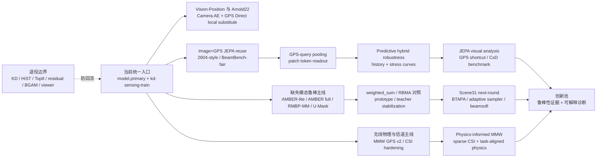
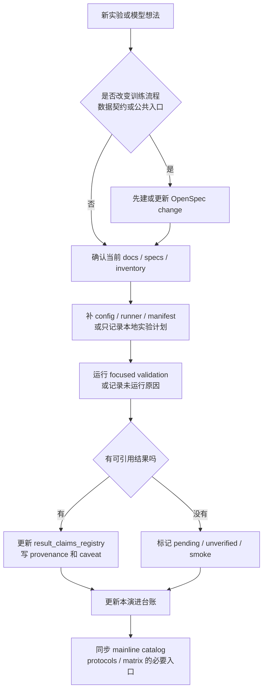

# 主线实验演进记录

本文件记录主线模型改进和实验决策的纵向脉络，帮助回顾“为什么走到这里”和“下一步创新点在哪里”。它不替代横向事实表：当前模型入口看 [mainline_model_catalog.md](mainline_model_catalog.md)，参数口径看 [experiment_protocols.md](experiment_protocols.md)，可引用数值和 claim 状态看 [result_claims_registry.md](result_claims_registry.md)，推荐运行顺序看 [experiment_matrix.md](experiment_matrix.md)。

最后更新：2026-07-03。

## 维护规则

- 每次新增主线实验、候选模型、关键 ablation 或复盘结论时，在“演进台账”补一行。
- 表中只写摘要、配置路径、claim id、本地产物路径引用和 caveat；真实 checkpoint、metrics、figures、logs 和 cache 仍留在 ignored 的 `outputs/`、`logs/` 或本地数据目录。
- 没有完整 provenance 的结果写 `pending`、`unverified`、`mock/smoke` 或 `historical ablation`，不要写成正式结论。
- 若某次实验改变训练流程、数据契约、公共入口或兼容性，先走 OpenSpec change；本表只记录决策脉络。
- 退役路线只能作为历史边界出现，不提供当前训练命令。

新增记录时优先补齐这些字段：

| 字段 | 维护含义 |
| --- | --- |
| 日期 | 实验完成、change 归档或复盘日期；不确定时写月份或 `pending`。 |
| 主线阶段 | 对应 `line_id`、能力名或实验 family。 |
| 代表配置 / artifact | config、manifest、脚本、claim id 或 OpenSpec change。 |
| 关键假设 | 这一步想证明什么，或想排除什么误判。 |
| 证据 / 状态 | 只写已登记数值、smoke 状态、blocked 原因或 pending。 |
| 决策 | 保留、升级、退役、只作对照、等待复跑等。 |
| 创新线索 | 可写成论文问题、方法贡献或下一轮机制假设的点。 |
| 下一步 | 最小可执行动作，通常是补跑、补 claim、补分析或收敛配置。 |

## 主线演进图

## 维护流程

## 演进台账

| 日期 | 主线阶段 | 代表配置 / artifact | 关键假设 | 证据 / 状态 | 决策 | 创新线索 | 下一步 |
| --- | --- | --- | --- | --- | --- | --- | --- |
| 2026-04 至 2026-05 | 项目表面收口与去 KD-first 化 | `project-architecture`、`distillation-free-project-surface`、README 当前入口 | 先把旧蒸馏、旧脚本和多模型 fallback 收束到单个 `model.primary`，后续实验才可横向比较。 | current specs / inventory 已把旧 KD、HiST、Top8、residual、BGAM 等标为 retired 或 supporting。 | 当前训练默认走 supervised/adaptation、JEPA、CSI、MMW、baseline/control 和诊断 workflow。 | 创新点不再放在“兼容旧路线”，而是放在可复现协议、可解释诊断和鲁棒性机制上。 | 新入口必须先进入 current docs/specs，避免恢复旧 facade 或旧命令。 |
| 2026-06 | Arnold22 / Vision-Position 基线重建 | `configs/fusion/beambench_image_ae_gps_direct.yaml`、`CLAIM-BB-TIII-CURRENT-BLOCKED` | 用本地 Camera AE + GPS Direct substitute 对齐 Table III 的输入、target 和 metric，厘清 official blocked 与 local substitute。 | official reproduction blocked；current-target strict numeric summary 尚未升级。旧 `future` target 结果只保留 historical ablation。 | 作为 Vision-Position 对照，不冒充 official Table III。 | “同一数据口径下，视觉表示与 GPS Direct 融合能否成为 JEPA 的强对照”是可写实验问题。 | 补 current-target strict run，并在 claim registry 中登记 commit、checkpoint、split 和 DBA/Top-K。 |
| 2026-06 | Image+GPS JEPA 2604-style 主线 | `image_gps_jepa_gps_biased_best_2604_s32_s34_lowmem.yaml`、`CLAIM-JEPA-2604-LOCAL-001` | 复用 JEPA 视觉表征和 GPS 条件是否能在 2604-style split 上形成强本地主线。 | 已登记 local strict-validation：S32/S33/S34 DBA `0.8777 / 0.8853 / 0.8796`，macro `0.8809`。 | 保留为当前可引用的 local 2604-style JEPA 结果，但不声明 paper exact split。 | “预训练视觉上下文 + GPS 条件”是主线表示学习贡献的基础证据。 | 与 supervised/random controls 保持同 family 对照；补 BeamBench-fair family 的真实 claim。 |
| 2026-06 | GPS-query pooling | `image_gps_jepa_gps_query_pool_best_*`、`CLAIM-JEPA-QUERY-PENDING` | 让 GPS query 主动读取 JEPA patch token，可能优于 mean pooling 或 GPS-biased reuse。 | pending / unverified；必须同 split、同 checkpoint family 成对比较。 | 保留为 Image+GPS JEPA 的主要改进候选。 | 贡献形态清晰：从“复用视觉表征”升级到“位置条件化 token readout”。 | 跑 BeamBench-fair 和 2604-style 成对实验，补 Top-K/DBA、attention 或 nearest-neighbor 证据。 |
| 2026-06 | JEPA visual analysis 与 GPS shortcut benchmark | `kd-sensing-jepa-visual-analysis`、`kd-sensing-jepa-gps-shortcut-benchmark`、`CLAIM-JEPA-VIS-DIAG`、`CLAIM-JEPA-SHORTCUT-PENDING` | 仅看 clean accuracy 不足以证明 JEPA 学到视觉语义，需要 shortcut、attention、embedding 和 stress evidence。 | visual analysis 是 diagnostic-only；shortcut smoke 只验证 schema；BeamBench-fair benchmark pending。 | 作为 claim gate，不单独当性能结论。 | 创新点从“准确率提升”扩展为“模型在 GPS shortcut 和图像退化下是否仍使用视觉证据”。 | 用真实 checkpoint 替换 smoke manifest，生成 robustness/drop/shortcut reliance 表。 |
| 2026-06 | Predictive JEPA robustness | `image_gps_jepa_predictive_hybrid_beambench_fair_lowmem.yaml`、`jepa_gps_shortcut_benchmark_predictive_robustness_smoke.yaml` | 当前图像不可观测或 GPS 受扰动时，history 和 predictive representation 是否能稳住 beam prediction。 | 训练 profile pending；完整 clean + image/GPS stress-curve real benchmark 尚未登记。 | 保留为独立鲁棒性主线，不等同 GPS-query pooling。 | 论文问题可写为“面向感知不可观测性的预测式 JEPA beam robustness”。 | 先训练 audited Image ResNet+GPS、JEPA baseline 和 predictive hybrid，再跑 real manifest。 |
| 2026-06 | BEV-Fusion 2604 | `configs/fusion/experiments/bev_fusion_2604/{paper_full,low_memory,smoke}.yaml`、`CLAIM-BEV2604-PENDING` | BEV 空间融合能否提供不同于 token/JEPA 的几何对照。 | formal / lowmem / smoke 协议已登记；真实 claim pending。 | 保留为 2604 paper-aligned 复现实验线。 | 可用来检验“显式 BEV 几何”与“JEPA token readout”的互补性。 | 跑 `paper_full` 或资源受限 `low_memory`，严格标注 approximation caveat。 |
| 2026-06 | 缺失模态本地 baseline 群 | AMBER-lite、AMBER full、RMBP-MM、TII-VLRG、AMR-Net current rows | 缺失模态鲁棒性需要本地可训练 baseline，而不是混用 official blocked 或外部不可控 artifact。 | 多数为 local experimental baseline / pending；不声明 official reproduction。 | 作为 U-Mask/RBMA/weighted_sum 的对照池。 | 创新点集中在 missing pattern 条件评估、可靠性 metadata 和 mask-aware fusion。 | 优先补齐 condition-level metrics、strict comparability fields 和 missing-pattern summary。 |
| 2026-07-03 | 缺失模态统计/stress gate | `add-missing-modality-statistics-stress-suite`、`CLAIM-MISSING-MODALITY-STRESS-PENDING` | 单 seed clean accuracy 不足以支撑论文缺失模态 claim，需要多 seed paired 统计和系统 stress manifest。 | 已补 schema、统计聚合、manifest normalizer、eval matrix comparability fields 和 focused tests；真实 metrics 仍 pending。 | 作为 AMBER/RMBP-MM/U-Mask/RBMA claim 升级前置 gate，不自动写 registry。 | 创新点从“固定 pattern 得分”升级为“统计显著 + stress-curve 鲁棒性证据”。 | 用真实 local runs 生成 formal manifest，补 paired baseline、CI 和 strict comparability 后再升级 claim。 |
| 2026-07-01 至 2026-07-03 | U-MaskBeamJEPA / RBMA / Scene31 next-round | `configs/fusion/experiments/rbma_missing_workflow/*`、`configs/scene31/next_round/experiment_manifest.*`、`add-scene31-adaptive-sampler-beamsoft-loss` | `proto_sampler_uniform_es40` 是当前 missing-modality 主胜者后，低侵入地验证 adaptive pattern exposure 与 beam topology soft supervision。 | RBMA claim pending；Scene31 BC change artifacts/tasks complete；真实训练输出仍应留在 ignored `outputs/scene31_next_round/`。 | weighted_sum / AMBER-style mask 作为下一轮主线，RBMA、condBTAPA、weakKD 等只作对照或局部候选。 | 两个可写机制：按 pattern 困难度自适应采样，以及利用 circular beam 邻域结构做 supervised soft target。 | 跑 B/C/BC P0 多 seed，fresh eval 后按 `avg_missing -> full -> overall_mean -> balanced` 汇总并补 claim。 |
| 2026-06 至 2026-07 | MMW GPS v2 与 CSI hardening | `configs/mmw_town_gps_adapter_v2.yaml`、`configs/csi/hardening_matrix/`、`CLAIM-MMW-GPSV2-PENDING`、`CLAIM-CSI-HARDENING-PENDING` | 无线场景的 label topology、scene shift 和 CSI hardening 需要独立诊断，不能直接套 image+GPS 结论。 | MMW GPS v2 是 formal diagnostic；CSI hardening full/debug matrix pending。 | 保留为 radio-side 解释和控制变量主线。 | 创新点是 circular label calibration、group-safe split、CSI degradation/hardening 与跨场景泛化之间的因果拆解。 | 补 MMW mapping enabled/disabled 对照和 CSI A/B/C/D/E matrix provenance。 |
| 2026-06-29 | Physics-informed MMW | `configs/fusion/physics_informed_mmw_*.yaml`、`CLAIM-PHYSICS-MMW-LOCAL-001` | 物理 path 参数、阵列一致性和 sparse CSI 能否提升 MMW beam prediction。 | 已登记 local summary：image+sparse CSI no-physics `0.7983 / 0.9793`，task-aligned PINN no-CSI-recon `0.8165 / 0.9760`；raw CSI reconstruction collapsed to `0.2843 / 0.5990`。 | sparse CSI 是主要增益来源；task-aligned physics 小幅提升 Top-1；raw CSI reconstruction 不作主目标。 | 创新点是“任务对齐物理约束”而不是重构全 CSI。 | 围绕 array consistency、beam power ablation 和 sparse pilot 口径补可复跑 run provenance。 |

## 创新线索池

| 线索 | 已有观察来源 | 可形成的问题 | 需要补的证据 |
| --- | --- | --- | --- |
| GPS-query token readout | JEPA query-pool pending rows | 位置 query 是否比 mean pooling 更好提取与 beam 相关的视觉 patch。 | 成对 Top-K/DBA、attention/nearest-neighbor、同 checkpoint family 对照。 |
| Predictive robustness | predictive hybrid + stress benchmark | 历史帧和预测表征能否缓解图像缺失、图像噪声和 GPS 噪声。 | clean anchor、stress curves、`margin_vs_resnet_dba`、strict comparability fields。 |
| GPS shortcut 诊断 | shortcut benchmark / visual analysis | 模型提升是否来自视觉语义，而不是 GPS shortcut。 | 真实 checkpoint matrix、shortcut reliance、CxD crossing、failure decomposition。 |
| Missing pattern 自适应采样 | Scene31 adaptive sampler change | 按 pattern 困难度调 exposure 是否比 uniform pattern balance 更稳。 | B P0/P1 多 seed、adaptive sampler log、delta vs uniform winner。 |
| Beam topology soft supervision | BTAPA / beam-neighborhood CE | circular beam 邻域是否能降低 MAE/within-3，同时不牺牲 hard Top-1。 | C/BC 多 seed、Top1/Top3/within_3/MAE、sigma/mix ablation。 |
| Reliability-aware missing fusion | U-MaskBeamJEPA / AMBER / RMBP-MM | 模态可靠性 metadata 能否解释哪些缺失条件真正需要 adaptive fusion。 | condition-level metrics、pattern summary、reliability diagnostics。 |
| Circular label calibration | MMW GPS v2 | beam label 环形拓扑和 scene offset 是否解释跨场景失败。 | mapping enabled/disabled、residual by theta/branch、group-safe split metrics。 |
| Task-aligned physics | physics-informed MMW | 物理约束何时帮助 beam task，何时因重构目标负迁移。 | no-CSI-recon、array/no-array、beam-power ablation 和 sparse pilot run provenance。 |

## 快速复盘问题

每次准备写论文段落或下一轮实验前，先按这几个问题扫表：

1. 哪一行已有 `local strict-validation` 或 `local experimental baseline` 数值，哪一行只是 `pending`？
2. 这个改进是否有同 family、同 split、同 metric 的 control？
3. 它解决的是准确率、鲁棒性、缺失模态、物理可解释性，还是复现口径？
4. 结论是否依赖 ignored 本地产物；claim registry 是否已经记录 provenance？
5. 它是否踩到了退役路线边界，或误把 historical ablation 当 current？
